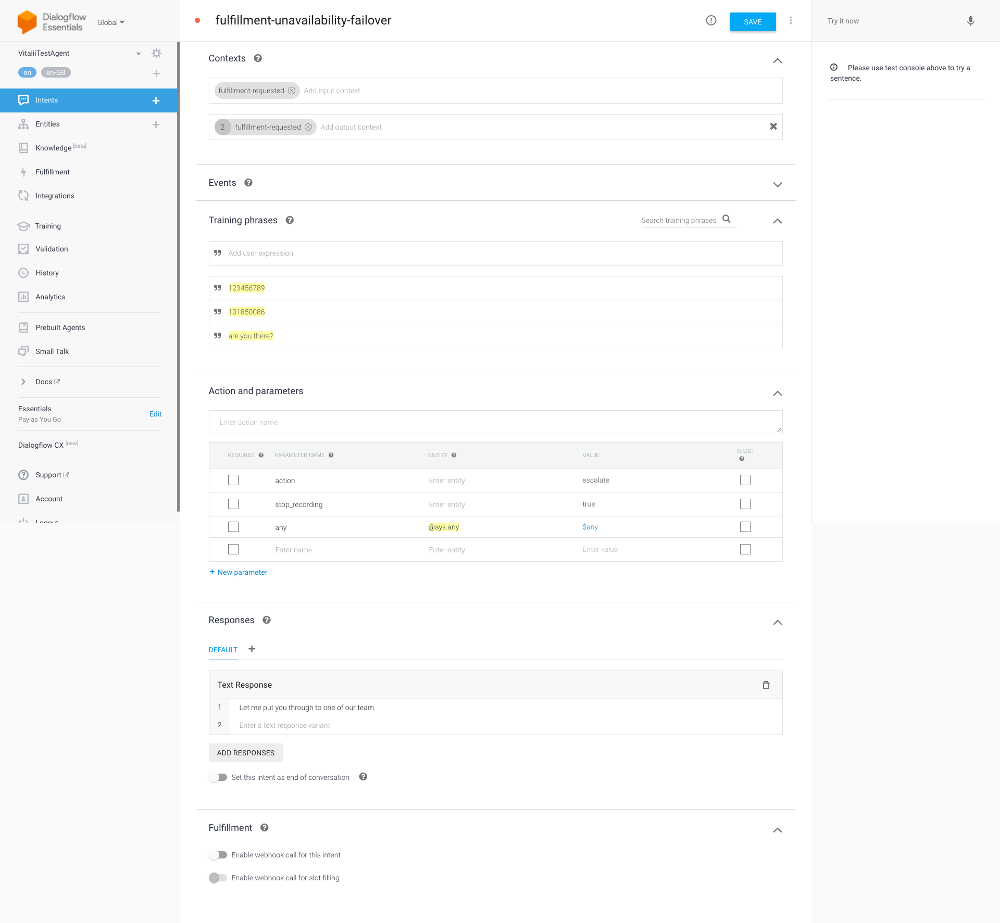

# Dialogflow Fulfillment Unavailability Handler

Sometimes conversational journeys require some response from fulfillment service. For example: in the end of ID&V process fulfillment service should return some [Followup Event Input](https://cloud.google.com/dialogflow/es/docs/fulfillment-webhook#event), but fulfillment service hasn't responded within 5(by default) seconds for some reasons. In this case Dialogflow will respond with the default text response which breaks normal flow as fulfillment service can't confirm result of the ID&V process. That's why it's important to escalate such calls to some "failover" endpoint.

In order to escalate or redirect calls which haven't received any response from the fulfillment service we can do the following:

1. Create a new intent which will be triggered in case of fulfillment unavailability with the following details:

- Input contexts: `fulfillment-requested`
- Output contexts: `fulfillment-requested(2)`
- Training phrases: any 3-5 phrases which marked as `@sys.any` entity
- Parameters: any extra parameters which you need to handle a call. For example, in order to escalate a call you can add `action`, `stop_recording` and `router_name` parameters
- Fulfillment: make sure webhook is disabled for this intent

Example of Fulfillment Unavailability intent:



2. Add `fulfillment-requested(3)` output context To all intents which expect any response form fulfillment service

3. Add this output context to all your fulfillment responses:

```
{
	lifespanCount: 0,
	name: `${sessionid}/contexts/fulfillment-requested`
}
```
This response won't allow DF to match an intent which we created in step 1 as it removes `fulfillment-requested` context by setting `lifespanCount: 0`. If fulfillment is not available and can't delete `fulfillment-requested` context, next utterance will match "fulfillment unavailability" intent.
