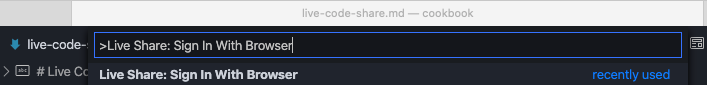
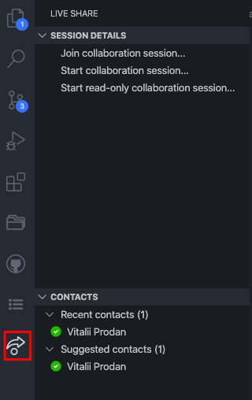
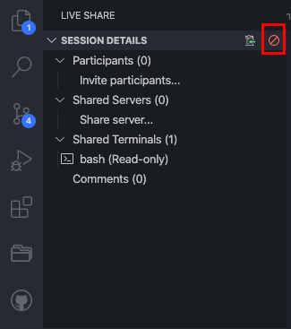

# Live Code Sharing

During the 4 hour pair programming interview we may need a tool to share code from a specific workspace or perhaps have a programming session with one of our teammates. From all the different approaches out there, at DVELP we propose the following:

## Getting Started

1. Install [Visual Studio Code](https://code.visualstudio.com), if not installed.
2. Install [Live Share Extension Pack](https://marketplace.visualstudio.com/items?itemName=MS-vsliveshare.vsliveshare-pack)
3. Restart Visual Studio Code app
4. Sign in with your GitHub account. To do that press `command+shift+P` for Mac or `control+shift+P` for Windows/Linux machines and type "Live Share: Sign In With Browser" -> "Sign in with GitHub"

5. Follow "Authorize Visual Studio Live Share" steps in your browser to continue singing in process
6. After this you should be able to start a live session. To do that, click on the relevant icon of "Live Share" extension on your activity bar

7. Now, you can start your live session simply by clicking on "Start collaboration session...". It should also copy an invitation link to your clipboard automatically, so you can share it with your peer
8. To stop your live session click on stop icon on "Session Details" panel

## Other Links

For more information visit [the official web-site](https://visualstudio.microsoft.com/services/live-share) of the extension.
