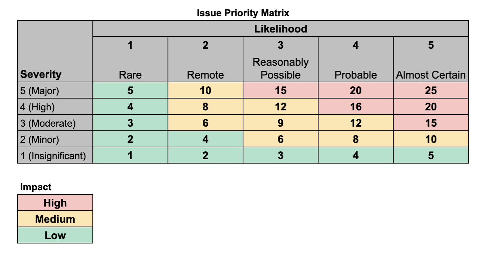

## Risk Management

### Risk Register

The company [Risk
Register](https://docs.google.com/spreadsheets/d/1gyK0zWSVlX-ZnXsN_c4-my86-hHjHEDY6IEP5h9UuVQ/edit?usp=sharing)
tracks all of the risks that members of the DVELP team have identified.

### Identifying Risks

All members of the DVELP team and all external stakeholders are asked to
contribute to the identification of
risks that we, as an organisation, face. Any newly identified risks can either
be emailed in to [security@dvelp.co.uk](mailto:security@dvelp.co.uk) or, if
you're a member of the DVELP team, directly added to our [Risk
Register](https://docs.google.com/spreadsheets/d/1gyK0zWSVlX-ZnXsN_c4-my86-hHjHEDY6IEP5h9UuVQ/edit?usp=sharing).

### Risk Assessment

Risks are assessed by their:

- Likelihood, on a scale from 1-5
- Severity if they were to occur, on a scale from 1-5

The product of these two figures results in the measure of their Impact.

The impact of a risk is then categorised as:

- **High**: Critical to the continued operation of DVELP, such as significant financial loss, major impact to reputation, loss of sensitive personal data
- **Medium**: Requiring quick resolution, significant impact on DVELP's operations, such as significant impact on reputation, damaging the trust with a client and/or partner
- **Low**: Can be accepted as normal business risk, mitigation plan not necessarily required

### Risk Mitigation

Where the anticipated impact of an unmitigated risk Medium or High, the
management team will work together to find a mitigating action that reduces the
impact to below this threshold.

### Ownership

Stephen Smith is the owner of this document. You can contact him on
<ssmith@sabiogroup.com >.
