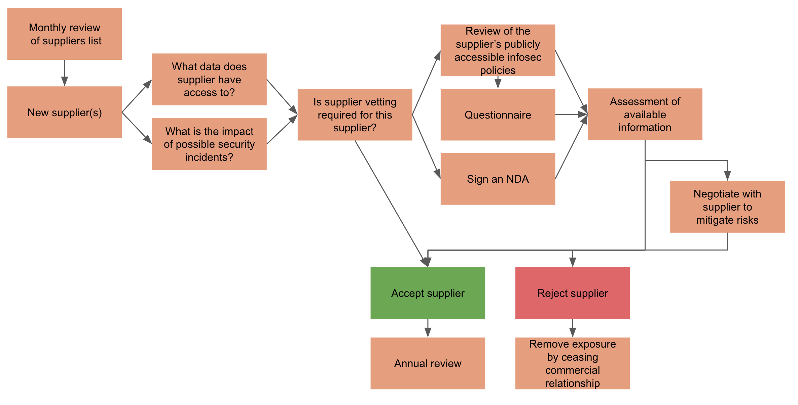

# Supplier Policy

In providing our services we rely on a number of third party suppliers that have
access to some of the sensitive information we handle. This policy sets out how
we vet our suppliers to ensure that we understand and assess the risks involved.

## Objectives

The objectives of our Supplier Policy are to:
* understand which of our suppliers are handling sensitive information on our
  behalf
* understand the risks created by our collaboration
* ensure the relevant suppliers follow best practices to minimise information
  security risks
* work with our suppliers to implement best practice where it is not being
  implemented
* make a conscious decision whether the risks we expose ourselves to are
  acceptable
* where we are exposed to unacceptable risk, mitigate this by ending the
  collaboration if necessary

## Vetting Process
The below diagram illustrates the process that the rest of this document
describes in more detail.

### Supplier List

Our [Supplier
List](https://docs.google.com/spreadsheets/d/14kog_nFut3v2t5mZNNatZ-oWb7tP3ImWdXjUP9EkZGc/edit?usp=sharing)
tracks the suppliers we interact with.

This is checked for completeness monthly by the [Information Security
Officer](../README.md#contacts).

We define suppliers as any organisation that has invoiced us. Therefore the
monthly update requires a review of our received invoices for new suppliers.

### Supplier Ownership

The Information Security Officer will assign a Supplier Owner to each Supplier
in the Supplier List. These owners are tracked in the Supplier List. They are
responsible for conducting the Vetting Process laid out below.

### Vetting Process

#### Vetting Requirement

While we work with a large number of suppliers, not all of them will have access
to sensitive information. Therefore some suppliers do not present a significant
Information Security risk and do not need to be vetted. Supplier Owners  assess
which suppliers require security vetting by considering the below two questions:

* What data does the supplier have access to?
* What is the impact of possible security incidents?

In light of these two considerations the Supplier Owner decides whether supplier
vetting is required for an individual  supplier.

If a supplier vetting is required, this is to be completed within two months of
the supplier being added to the Supplier List.

#### Vetting Assessment

In order to assess an individual supplier, the Supplier Owner will review the
publicly available information of the supplier's information security policies
and processes.

If there is not sufficient information available publicly to conduct the review,
the Supplier Owner will send out the [Supplier Security
Questionnaire](https://goo.gl/forms/3J0BmcrOIhUxGP2x1) to the supplier to gather
further information. Responses to the Questionnaire can be found
[here](https://docs.google.com/spreadsheets/d/1q4TB_HkJubEPoc4MjeColk0LG9AUr-6_2d_UvrnbY4g/edit?usp=sharing).

If the supplier is a small organisation or an individual, the Supplier Owner may
ask the supplier to sign an Non-Disclosure Agreement (NDA) in order to ensure
sensitive information will be treated confidentially by the supplier. Our
standard NDA template is available
[here](https://docs.google.com/document/d/1O_-nk5FLp-h5IycOM5Ntv0RxOcTWGWq7kfGZKqM8se4/edit?usp=sharing).

In conducting the Vetting Assessment, the Supplier Owner assesses the available
information and answers the following questions:
1. Do we as an organisation sufficiently understand the risks of working with
   this supplier?
2. Has the supplier adequately mitigated the risk of security incidents to
   minimise the probability of them occurring?
3. Does the supplier's incident reporting policy allow us to effectively manage
   such incidents if they do occur?

If the answer to all three questions is yes, the Supplier Owner accepts the
supplier.

#### Negotiating Mitigations

If the answer to any of the three Vetting Assessment questions is no, the
Supplier Owner may negotiate with the supplier to try to better mitigate the
risks.

Where such negotiations are entered, the final decision may be delayed by up to
two months. If at the end of these two months the three Vetting Assessment
questions can not confidently be answered with yes, the supplier needs to be
rejected.

#### Rejecting a Supplier

If a supplier has been rejected the commercial relationship should be ended
within two months of the decision to reject.

#### Accepting a Supplier

If a supplier has been accepted the commercial relationship can continue and a
review of the supplier's policies should be scheduled. This is tracked in the [Supplier
List](https://docs.google.com/spreadsheets/d/14kog_nFut3v2t5mZNNatZ-oWb7tP3ImWdXjUP9EkZGc/edit?usp=sharing).

