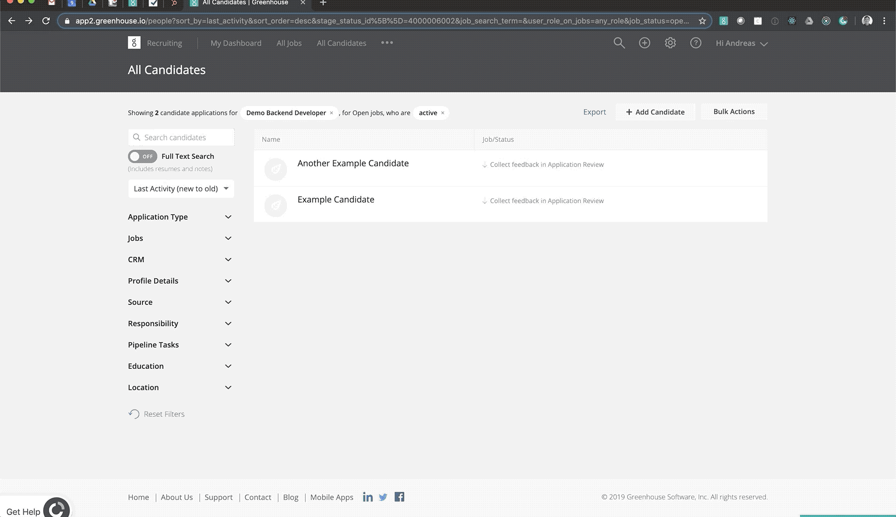
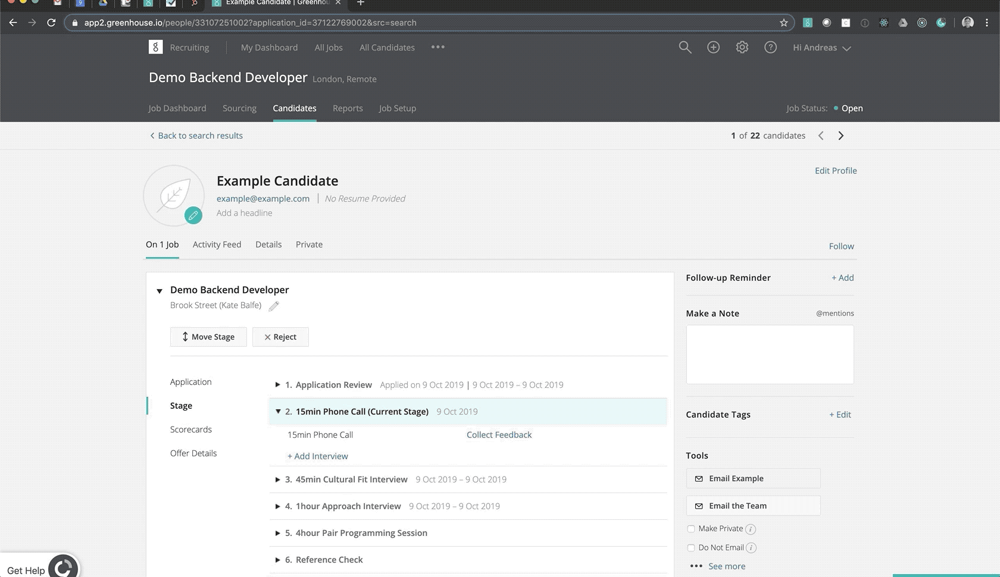
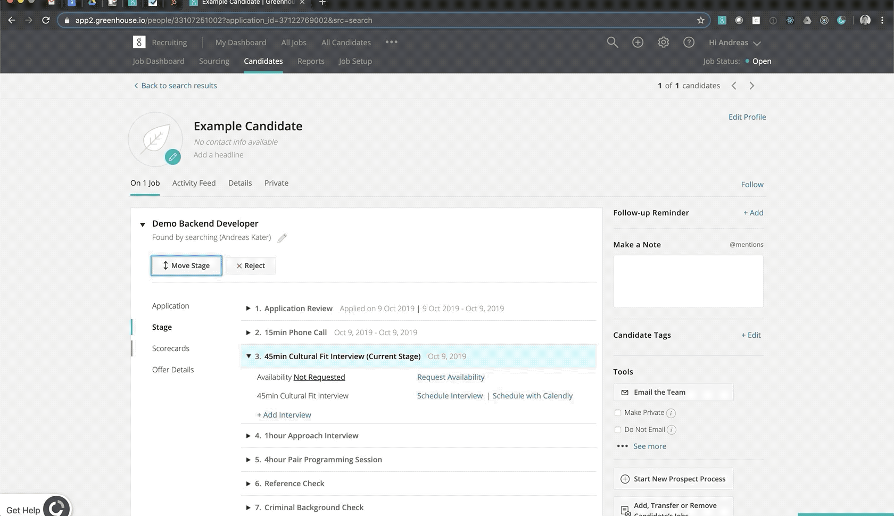
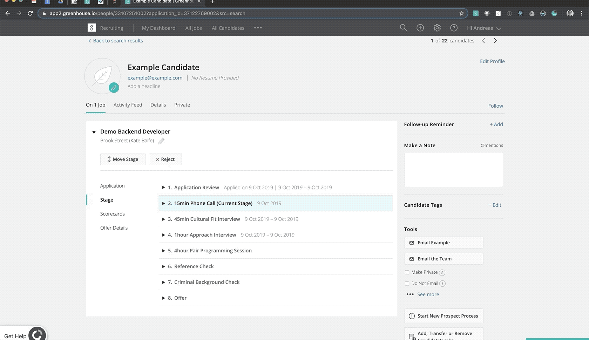

# Interviewing

We use Greenhouse to coordinate our interview process. Below you can find the steps you should take if you have been asked to interview one of our candidates.

If you have any questions regarding this process, please get in touch with <andreas@dvelp.co.uk>.

### 1. Visit Greenhouse and filter for the candidates you are currently responsible for

Visit [Greenhouse](https://app2.greenhouse.io/people).

### 2. Schedule Interview

When you are assigned the coordinator of a candidate, it's your responsibility to schedule the next interview. Please email the candidate and their recruiter to arrange this from within Greenhouse by clicking on the `Email {Candidate First Name}` button.

Make sure to copy in the `Agency Recruiter`. If we don't have the candidate's email address on record, only email the `Agency Recruiter`.

### 3. Conduct Interview and Submit Scorecard

After/during an interview fill in the relevant Scorecard on Greenhouse. See below for where to find this.

### 4. Assign Andi as coordinator

Once you have conducted the interview you can hand the candidate back over to Andi by assigning him as a coordinator. Andi will then coordinate next steps for the candidate.

