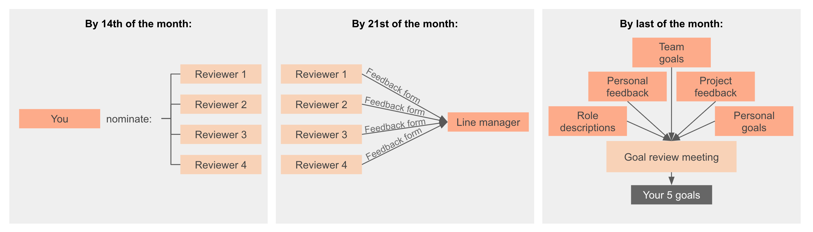

# Goals

As part of our professional development culture, we strongly believe in goals.
Explicitly defining the goals we want to achieve gives our every day work
direction and focus.

At DVELP we have goals that apply at both team and personal levels. Team goals
make it explicit to the rest of the organisation what each team is trying to
achieve. Personal goals are an opportunity for team members to work on their
personal & professional development by pursuing goals that are catered for their
individual advancement.

We have captured our best practice on setting goals in [this
document](smart-goals.md).

## Personal Goals

Each of us should have three goals defined at any one time that state what
we are currently trying to achieve. These goals are publicly shared with the
rest of the team on our [feedback
platform](https://dvelp-feedback.firebaseapp.com/) so that others are aware of
our plans and can help us achieve them. As part of our review process we choose
the three people we have worked most closely with and give them detailed
feedback on their progress towards goals, what they did well, could improve, and
any other situational feedback.

The goals are set once a quarter in a conversation with our line manager, as per
the below schedule.

### Goal Review Process

You can find our feedback platform
[here](https://dvelp-feedback.firebaseapp.com/).

  At our Goal Review Meeting, we work with our Line Manager to:

  1. Mark the goals that we have managed to achieve as complete

  2. Choose new goals to work towards over the next quarter

  The choice of a new goal is informed by:
  * The Role Description for our current role. For the developers, this can be
    found [here](developer-proficiency.md).
  * The feedback forms we have received from our peers
  * The Team Goals that each department is working towards
  * Project Feedback, which we have received from our customers
  * Personal development objectives

Further instructions on how to provide feedback and set goals is provided on our
feedback platform [here](https://dvelp-feedback.firebaseapp.com/).

### Goal Review Schedule

