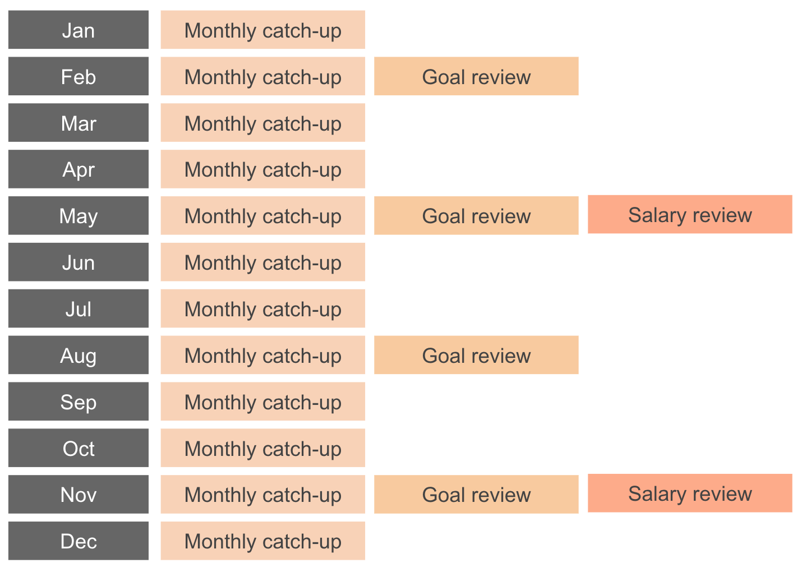

# Goals

As part of our professional development culture, we strongly believe in goals.
Explicitly defining the goals we want to achieve gives our every day work
direction and focus.

At DVELP we have goals that apply at both team and personal levels. Team goals
make it explicit to the rest of the organisation what each team is trying to
achieve. Personal goals are an opportunity for team members to work on their
personal & professional development by pursuing goals that are catered for their
individual advancement.

We have captured our best practice on setting goals in [this
document](smart-goals.md).

## Personal Goals

Each one of us should have five goals defined at any one time that state what we
are currently looking to achieve. These goals are publicly shared with the rest
of the team on our CharlieHR platform so that others are aware of our plans and
can help us achieve them. As part of our review process we ask the people we
have worked closely with to give us feedback on our progress towards each goal.

The goals are set once a quarter in a conversation with our line manager, as per
the below schedule:

## Goal Review Process

Leading up to each Goal Review, we each ask the four people we've worked closest
with to give us feedback.

These four people then fill in a feedback form and submit this to our line
manager.

We use [CharlieHR](https://www.charliehr.com/) to run this review cycle.

At our Goal Review Meeting, we then work with our line manager to choose the
goals we want to work towards. Where a goal has been achieved it can be replaced
with a new one.

The choice of a new goal is informed by:
* The Role Description for our current role. For the developers, this can be
  found [here](developer-proficiency.md).
* The feedback forms we have received from our four selected peers
* The Team Goals that each department is working towards
* Project Feedback, which we have received from our customers
* Personal development objectives
